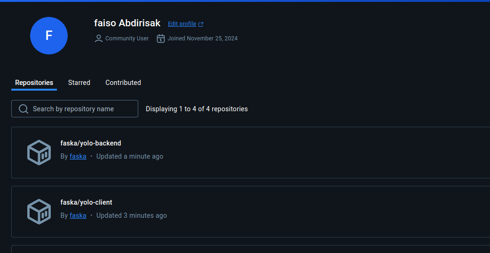

# Yolo Application
## Author   :Faiso Abdirisak

### Application Description
This is an ecommerce web app for both male and female.
## Requirements
Make sure that you have the following installed:
- [node](https://www.digitalocean.com/community/tutorials/how-to-install-node-js-on-ubuntu-18-04) 
- npm 
- [MongoDB](https://docs.mongodb.com/manual/tutorial/install-mongodb-on-ubuntu/) and start the mongodb service with `sudo service mongod start`

## Navigate to the Client Folder 
 `cd client`

## Run the folllowing command to install the dependencies 
 `npm install`

## Run the folllowing to start the app
 `npm start`

## Open a new terminal and run the same commands in the backend folder
 `cd ../backend`

 `npm install`

 `npm start`

 ### Go ahead a and add a product (note that the price field only takes a numeric input)

 ## Technologies used
    * BackEnd: * Nodes 
    * FontEnd:  React 
    * Database * Mongo
    * Docker containerization

 ## Using Docker Compose
 ###   Procedure.
 * Create <code> docker-compose.yml </code> file
 * cd into backend and add <code> Dockerfile </code> and add neccessary port(5000) for nodejs
 * cd into front-end and add <code> Dockerfile </code> and add neccessary port(3000) for react app
 * ensure you have installed docker compose in your system if not follow this [link](https://www.digitalocean.com/community/tutorials/how-to-install-and-use-docker-compose-on-ubuntu-20-04) for linux system.
 * run <i><code>  sudo docker-compose build </code></i> to start building
 * the run <i><code> sudo docker-compose up </code></i> to start application

 ## How to run the app

* `vagrant box list ` to list the machines installed
* `vagrant add ubuntu/jammy64` to add
### while on the folder  run:
* `vagrant init ubuntu/jammy64` to initialize
* `vagrant up` to run the machine
* `vagrant status` to check if its running
* `vagrant ssh` to went into the virtual machine
* to logout `exit`
* `vagrant ssh-config` to check the configuration
* to connect the server `ssh vagrant@127.0.0.1 -p 2222 -i the relative path of identity file`
* solve the error by running `ssh-keygen  -R '[127.0.0.1]:2222'`

* then rerun the previous command

* `create host address: 127.0.0.1 ansible_port=2222`
* create ansible.cfg
* create ansible playbook.yaml
### when you want to run the application
Use `vagrant provison` command

## Contact Information 

If you have any question or contributions and support, please email me at [faisoabdirisak@gmail.com](faisoabdirisak@gmail.com)

LinkedIn - [Faiso Abdirisak](www.linkedin.com/in/faiso-abdirisak/)

Portfolio- [Faiso](https:/my-portfolio-eight-sigma-93.vercel.app/)
# Licence

Click to  [MIT License](Licence) view

 Copyright (c) 2025 | Faiso Abdirisak